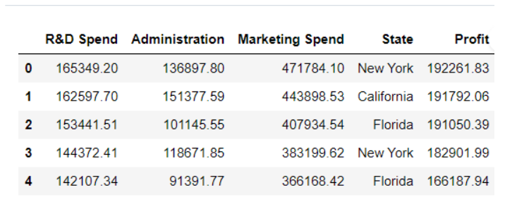
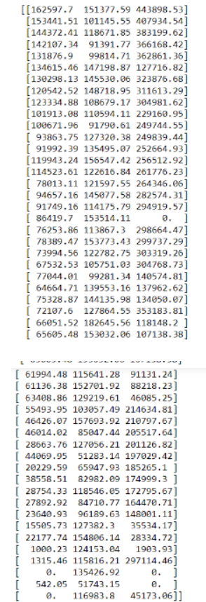
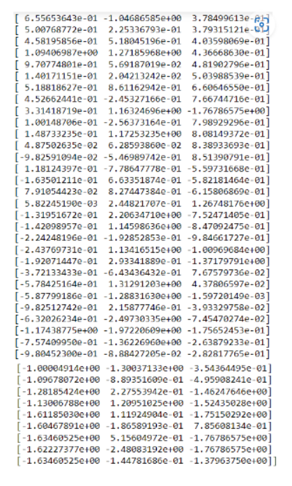
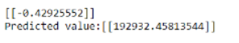

# Implementation-of-Linear-Regression-Using-Gradient-Descent

## AIM:
To write a program to predict the profit of a city using the linear regression model with gradient descent.

## Equipments Required:
1. Hardware – PCs
2. Anaconda – Python 3.7 Installation / Jupyter notebook

## Algorithm
1.Initialize weights randomly.
2.Compute predicted values.
3.Compute gradient of loss function.
4.Update weights using gradient descent.

## Program:
```
Program to implement the linear regression using gradient descent.
Developed by: SUDHIR KUMAR
RegisterNumber:  212223230221
```
```python
import numpy as np
import pandas as pd
from sklearn.preprocessing import StandardScaler

def linear_regression(X1, y, learning_rate=0.01, num_iters=1000):
    X = np.c_[np.ones(len(X1)), X1]
    theta = np.zeros(X.shape[1]).reshape(-1,1)
    for _ in range(num_iters):
        predictions = X.dot(theta).reshape(-1, 1)
        errors = (predictions - y).reshape(-1, 1)
        theta = theta - learning_rate * (1 / len(X1)) * X.T.dot(errors)

    return theta

data = pd.read_csv('50_Startups.csv')
X1 = data.iloc[:, :-1].values.astype(float)
scaler = StandardScaler()
y = data.iloc[:, -1].values.reshape(-1, 1)
X1_scaled = scaler.fit_transform(X1)
y_scaled = scaler.fit_transform(y)
theta = linear_regression(X1_scaled, y_scaled)
new_data = np.array([165349.2, 136897.8, 471784.1]).reshape(1, -1)
new_scaled = scaler.transform(new_data)
new_scaled_with_intercept = np.append(1, new_scaled) 
prediction = np.dot(new_scaled_with_intercept, theta)
prediction = scaler.inverse_transform(prediction.reshape(-1, 1))
print(f"Predicted value: {prediction}")
```

## Output:






## Result:
Thus the program to implement the linear regression using gradient descent is written and verified using python programming.
